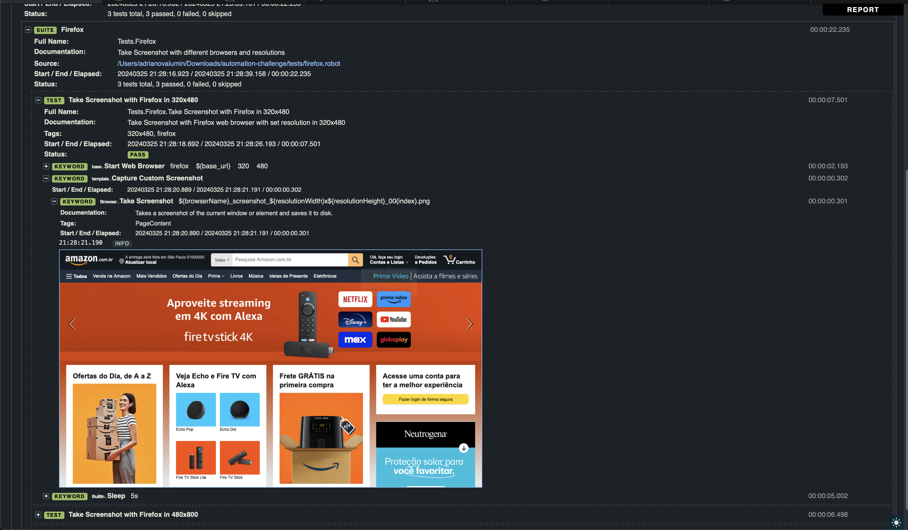

# Taller Web Automation Challenge

This repository contains the challenge project for web automation using Robot Framework.

## Installation

Robot Framework is implemented with Python, so you need to have [Python](https://www.python.org/downloads/) installed.
On Windows machines, make sure to add [Python to PATH](https://docs.python.org/3/using/windows.html#the-full-installer) during installation.

## Installing Robot Framework & Libraries

Installing Robot Framework and all required libraries with pip is simple:

```{shell}
pip install -r dependencies/requirements.txt
```

We need to install the Robot Framework Libraries that we plan to use in our tests.

### [Browser Library](https://robotframework-browser.org/)

Browser Library requires [NodeJs](https://nodejs.org/en/download).

[Install Browser Library:](https://docs.robotframework.org/docs/different_libraries/browser)


Install the node dependencies:

```{shell}
rfbrowser init
```

- if rfbrowser is not found, try:

```{shell}
python -m Browser.entry init
```

## Code Editor
We need to install a code editor to write Robot Framework scripts. We recommend using [Visual Studio Code](https://code.visualstudio.com/download).

## Running Automation Tests
To start the automation script, run the following command:

```{shell}
robot -d results tests
```

This is going to run all the test cases. If you want to run a specific test case, you can specify the test case tag:

```{shell}
robot -i firefox -d results tests
```

The example fiven above will run all the test cases with the tag `firefox`.
Here are the list for available test tags:
'firefox', 'chromium', 'webkit', '320x480', '480x800', '768x1024'

## Checking HTML Report
After running the tests, you can check the HTML report generated in the `results` folder. File `log.html` contains more details while `report.html` is the main summary.
Inside each Suite/Test, it was added the information 'Website' with the URL of the website that was tested.
Test report also have white/dark mode. To switch, just click on the sun/moon icon on the bottom right corner.

Screenshots are also saved in the `results/browser/screenshot` folder. 
They are also present inside the HTML report. To check, you'll need to open the HTML report, search for the test case, expand the steps and find for the keyword `Take Screenshot`.

